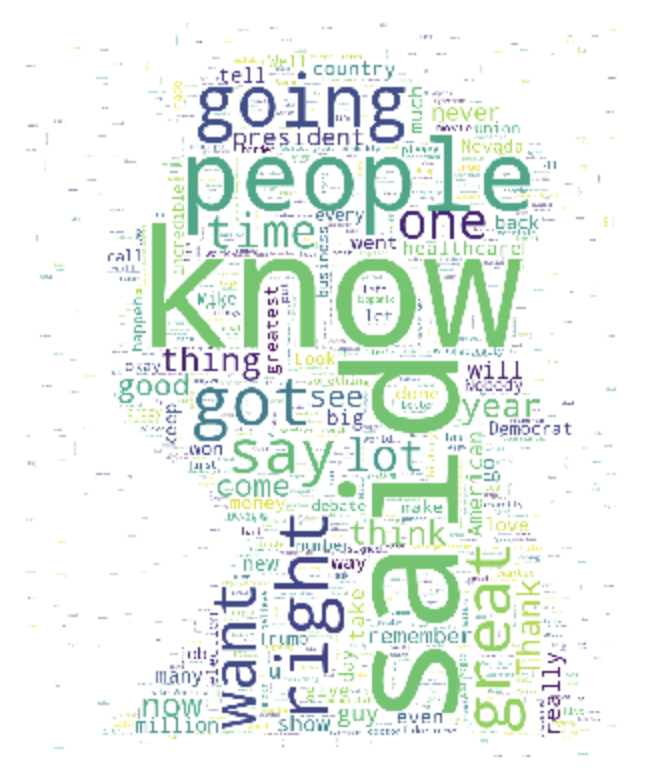
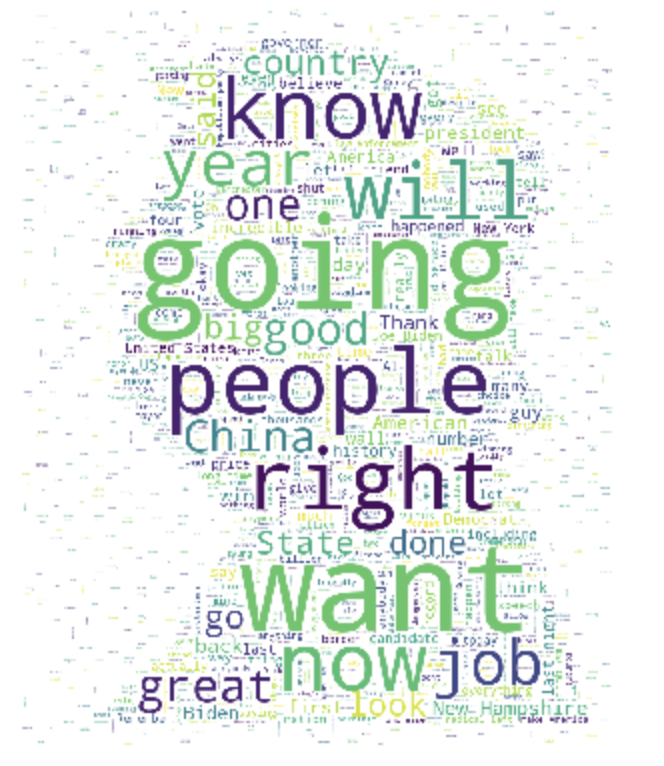
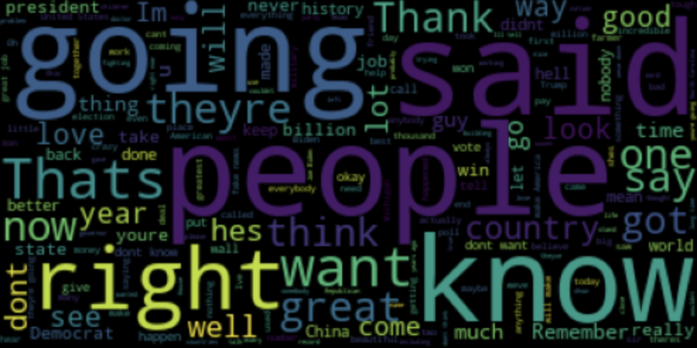
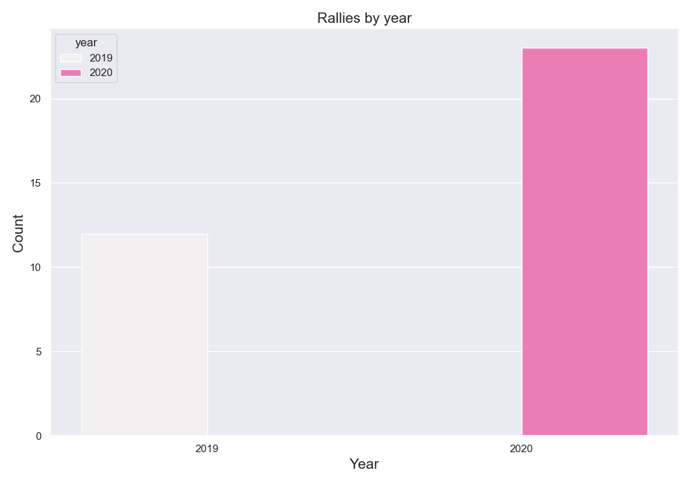
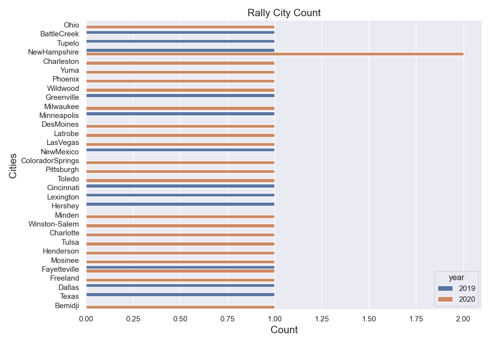

# Project 4

# Title: Donald Trump Rally Speeches 


### Task: Build an API that queries data from mySQL database and output in a localhost browser window. Lastly, apply NLP for the selected text to gain a sentiment score. 

---------

## Table of contents
1. Project Focus
2. Questions & Hypothesis 
3. Tools & Method
4. Code breakdown 
5. API Calls
5. Visualisation 
6. Conclusions
7. Next Steps

---------

## 1. Project Focus
Using SQL and creating our own API the focus of this project is to demonstrate our abiliy to upload data into mySQL, create an API and call quieres. I chose to collect Donald Trump's rally speeches text to transform, upload and analyse. 

----------
## 2. Questions & Hypothesis 
- Using NLP, what sentiment do the speeches have? 
- What langage is most common? 

Hypothesis: The speeches will be full of simple populist retoric. 
 
--------
## 3. Tools & Method 


For this particular project we had to demonstrate our ability to be the data provider. Using an extraction, transform and load method. 

- (A) I downloaded a data set from Kaggle - (https://www.kaggle.com/datasets/christianlillelund/donald-trumps-rallies)

I imported the following tools to run the code: 

```python

import os

import json
import requests


from functools import reduce
import operator

import pandas as pd
import numpy as np
import re

import sqlalchemy as alch
from getpass import getpass
```
- (B) Cleaned the dataset.
- (C) Upload the data to SQL.
- (D) Create the API. 
--------
## 4. API Calls

- Requests
```python
# Requesting all content 
request_all = requests.get('http://localhost:9000/sql')
# API Call
request_all.json()

# Requesting a random speech 
random_speech = requests.get('http://127.0.0.1:9000/random')
# API Call 
random_speech.json()

# Requesting Speech Sentitments 
speech_sentiments = requests.get('http://127.0.0.1:9000/sentiment_all')
# API Call 
speech_sentiments.json()

# Requesting Sentitment by location 
city_sentiment = requests.get('http://localhost:9000/sentiment/Ohio')
# API Call 
city_sentiment.json()

# Returns random phrase with sentiment 
random_phrase_sentiment = requests.get('http://localhost:9000/random-sentiment')
# API Call 
random_phrase_sentiment.json()

```
- Posts
```python

headers = {'location':'New York', 'dates':'mar21', 'years':'2022', 'speech':'Hello world.'}
requests.post('http://localhost:9000/insertrow', params=headers)
<Response [200]>
```
--------
## 5. Visualisation 

In terms of visualising the data, I chose to perform a sentiment analysis of Trump's speeches using Natural Language Processing. From which I used the WordCloud function to visualise the findings. 


### Las Vegas Rally Speech WordCloud


### New Hampshire Rally Speech WordCloud


### Combined Rally Speech WordCloud


### Rallies by year


### Rally Count by City



-------- 
## 6. Conclusions 

The linguistic content of Trump's speeches aligns with typical populaist rhetoric. Simple clear language that after NLP can be stated as positive in terms of sentiment. 


-------- 
## 7. Next Steps 

To improve this project, the next steps would be the following;

- Clean the dates data futher. 
- Separate the speech data into rows to be able to randomly request sentences. 